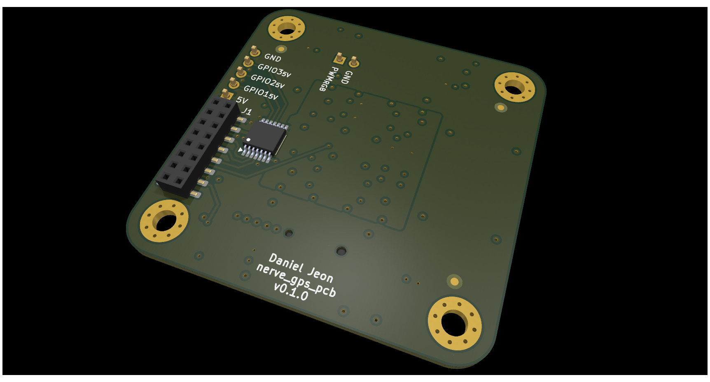

# nerve_gps_pcb

Production optimized GPS module board for
the [nerve_pcb](https://github.com/danielljeon/nerve_pcb) project.

---

  
Table of Contents

<!-- TOC -->
* [nerve_gps_pcb](#nerve_gps_pcb)
  * [1 Overview](#1-overview)
  * [2 Board Specifications](#2-board-specifications)
    * [2.1 Connectors](#21-connectors)
  * [3 Release Notes](#3-release-notes)
    * [3.1 v0.1.0-alpha](#31-v010-alpha)
    * [3.2 v0.1.0](#32-v010)
<!-- TOC -->

---

## 1 Overview

|                         Top                          |                           Bottom                           |
|:----------------------------------------------------:|:----------------------------------------------------------:|
|  |  |

---

## 2 Board Specifications

### 2.1 Connectors

Connectors fixed by hardware (PCB traces or the connector itself).

| Connector                      | Ref | Description                                       |
|--------------------------------|:---:|---------------------------------------------------|
| Bottom side 2x8 board-to-board | J1  | See schematic/layout for details                  |
| WS2812B PWM breakout           | J2  | Pin 1: PWM RGB, Pin 2: Ground                     |
| 5 V GPIO breakout              | J3  | Pin 1: 5 V, Pin 2-4: GPIO1-3 (5 V), Pin 5: Ground |

---

## 3 Release Notes

### 3.1 v0.1.0-alpha

- Pre-release 4-layer board variant.
    - Short-term pre-release board bring-up/testing release.
- Order date: 2025/01/13.

### 3.2 v0.1.0

- Minor changes from the previous `v0.1.0-alpha` pre-release version.
    - Fixed the Double-inverted UART connection issue.
